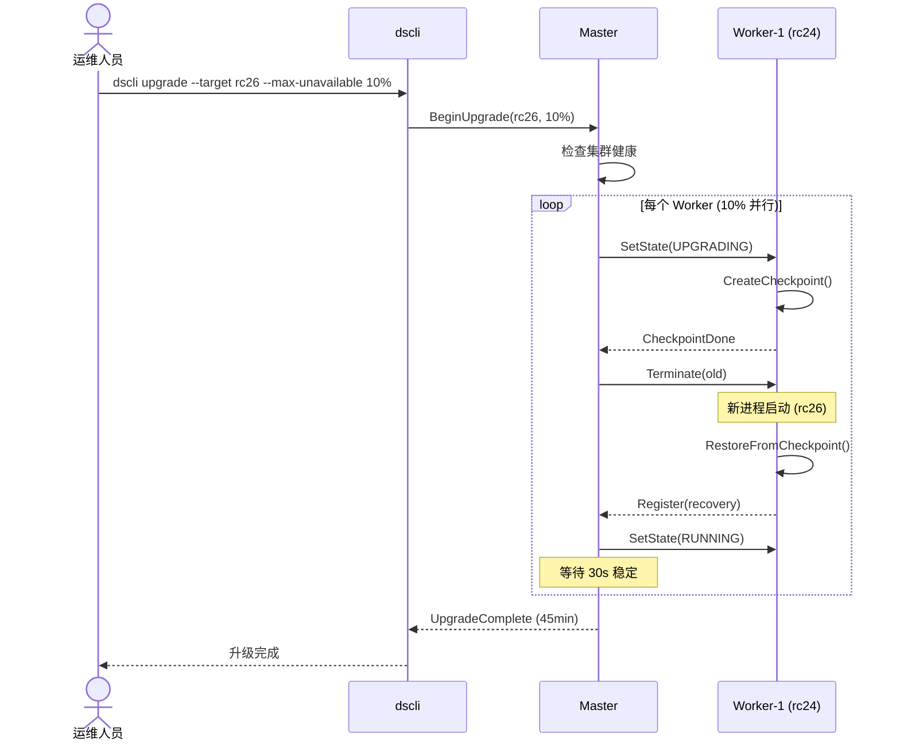
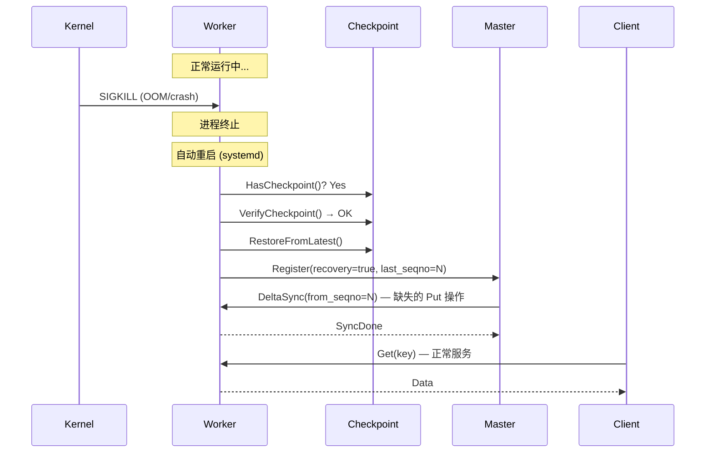
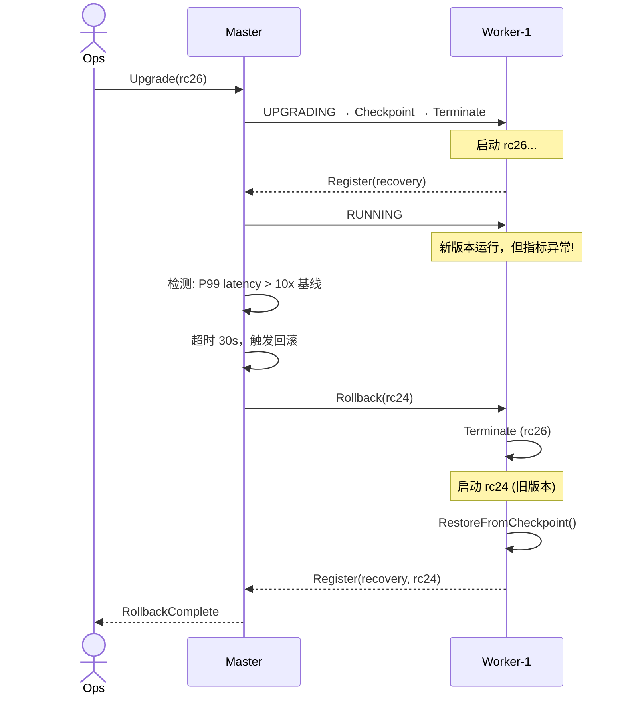
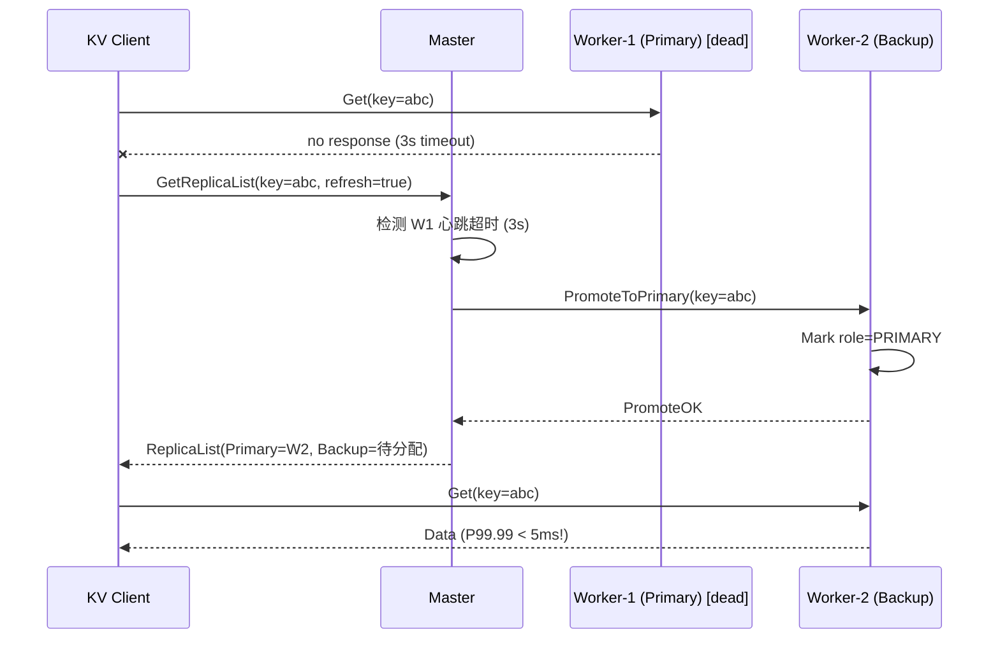
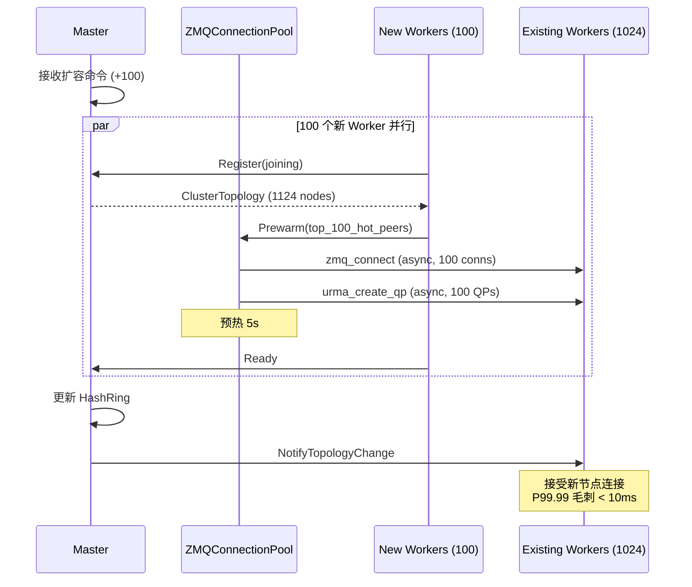

# 用例描述 (Use Cases)

## UC-1: 运维人员滚动升级 100 节点集群

**前置条件**: 集群 100 Worker (rc24)，全部 RUNNING，服务正常
**后置条件**: 集群 100 Worker (rc26)，数据零丢失，升级中服务可用

**验收标准**:
- [ ] 全量升级 < 60min
- [ ] 升级过程中 P99 latency < 2x 基线
- [ ] 升级后 5min 内指标恢复正常
- [ ] 零数据迁移，零 cache miss 增加

---

## UC-2: Worker 异常崩溃后快速恢复

**前置条件**: Worker 已有至少 1 个成功 Checkpoint，RocksDB 数据完整
**后置条件**: Worker 恢复 RUNNING，丢失 < 10s 写入数据

**验收标准**:
- [ ] 恢复时间 < 3s (从进程启动到 RUNNING)
- [ ] 恢复后 5s 内正常服务
- [ ] 数据丢失窗口 = Checkpoint 间隔 (10s)

---

## UC-3: 升级失败自动回滚

**前置条件**: Worker 升级到 rc26 后指标异常
**后置条件**: Worker 回退到 rc24，数据不丢失，服务恢复

**验收标准**:
- [ ] 异常检测 < 30s
- [ ] 回滚执行 < 10s
- [ ] 回滚后指标恢复正常

---

## UC-4: 主副本故障 → 备副本无缝接管

**前置条件**: key=abc 有 Primary(W1) + Backup(W2)，W1 正常后故障
**后置条件**: W2 提升为 Primary，Client 继续正常读取

**验收标准**:
- [ ] 故障检测 < 3s
- [ ] Promote 完成 P99.99 < 5ms
- [ ] Client 自动切换，无业务感知

---

## UC-5: 1024 节点集群扩容 100 节点

**前置条件**: 1024 节点集群正常运行
**后置条件**: 1124 节点集群正常运行，扩容过程无毛刺

**验收标准**:
- [ ] 100 节点全量扩容 < 30s
- [ ] 扩容过程中 P99.99 < 10ms
- [ ] 新节点连接池命中率 > 90%

---

## 用例与 SR 追溯矩阵

| Use Case | RFC | IR | SR | 验收关键指标 |
|----------|-----|----|----|-----------|
| UC-1 滚动升级 | RFC1 | IR-1,IR-3,IR-4 | SR-1.1~SR-4.2 | 全量升级 < 60min, 零迁移 |
| UC-2 崩溃恢复 | RFC1 | IR-1,IR-2 | SR-1.2,SR-2.1,SR-2.2 | 恢复 < 3s, 丢失 < 10s |
| UC-3 升级回滚 | RFC1 | IR-3 | SR-3.3,SR-3.4 | 检测 < 30s, 回滚 < 10s |
| UC-4 故障切换 | RFC2 | IR-7 | SR-7.1~SR-7.4 | P99.99 < 5ms |
| UC-5 扩容 | RFC4 | IR-13,IR-14 | SR-13.1,SR-14.3 | 扩容 < 30s, P99.99 < 10ms |
