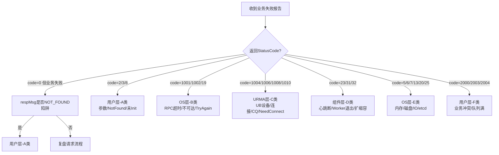
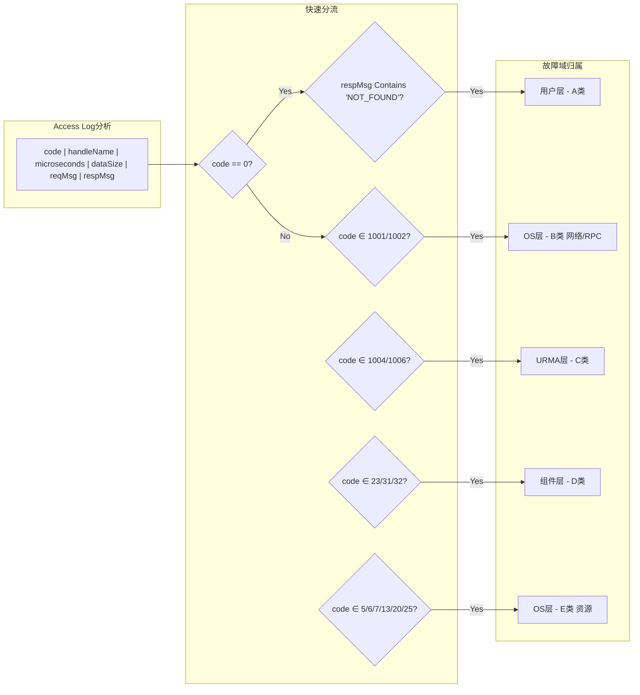
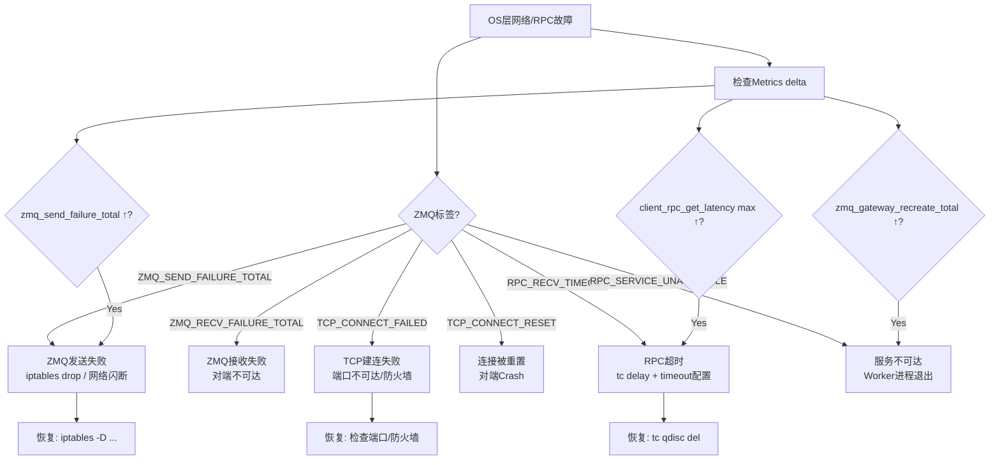
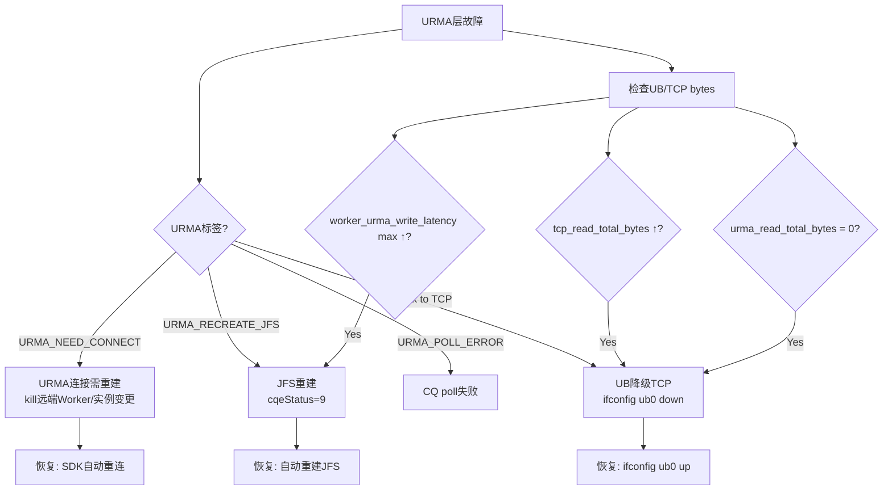
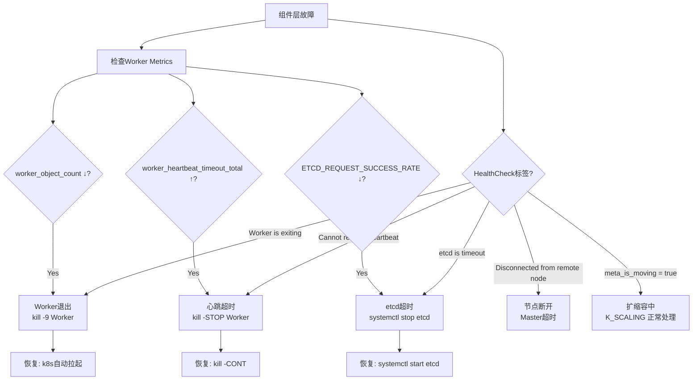
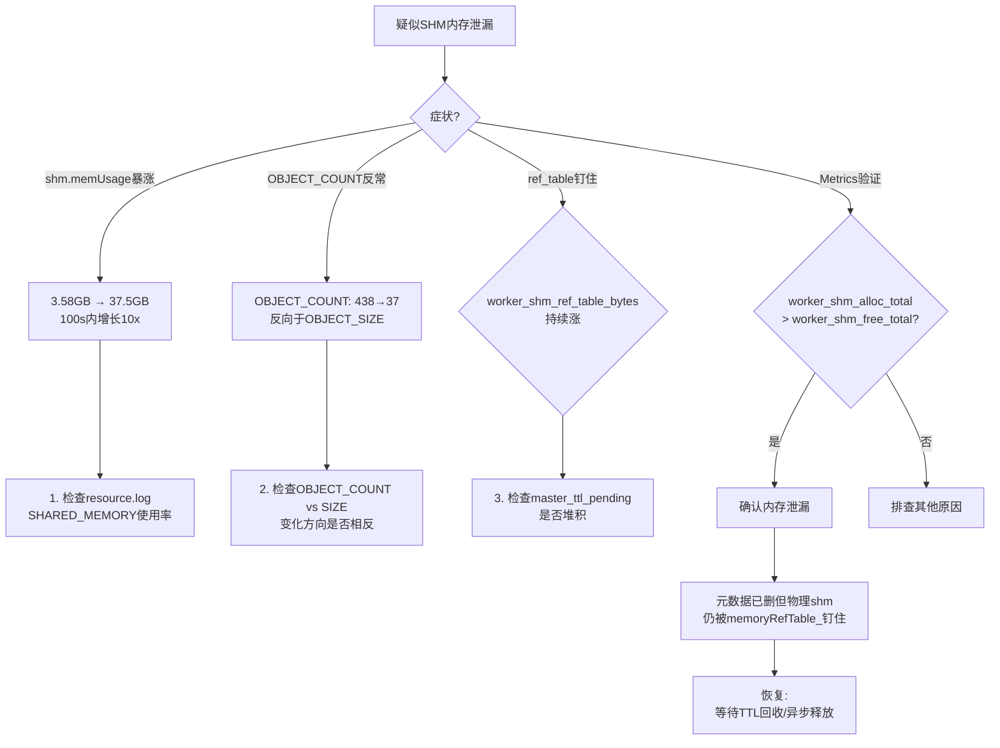
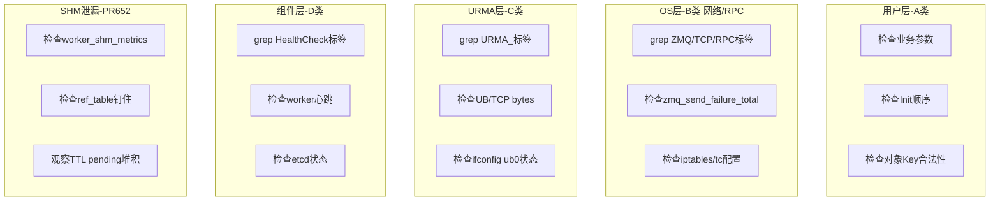
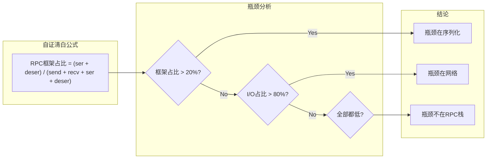

# 故障定位定界流程图 v2.0

> 三阶段故障排查流程：快速定界 → 识别关键问题 → 处理措施建议

---

## 阶段一：快速定界（30秒）

### 1.1 错误码 → 故障域速判定



### 1.2 Access Log + 错误码 快速分流



---

## 阶段二：识别关键问题（5分钟）

### 2.1 OS层-B类 诊断流程



### 2.2 URMA层-C类 诊断流程



### 2.3 组件层-D类 诊断流程



### 2.4 SHM内存泄漏-PR#652 诊断流程



---

## 阶段三：处理措施建议

### 3.1 按故障域推荐处理



### 3.2 故障恢复措施速查表

| 故障类型 | 恢复命令 | 验证方法 |
|---------|---------|---------|
| ZMQ发送失败 | `iptables -D OUTPUT -p tcp --dport X -j DROP` | `zmq_send_failure_total` delta=0 |
| RPC超时 | `tc qdisc del dev eth0 root netem` | latency恢复到baseline |
| TCP建连失败 | `iptables -D INPUT -p tcp --dport X -j REJECT` | `[TCP_CONNECT_FAILED]`消失 |
| URMA需重连 | SDK自动重连(等待`K_TRY_AGAIN`) | `[URMA_NEED_CONNECT]`消失 |
| UB降级TCP | `ifconfig ub0 up` | `urma_read_total_bytes`恢复>0 |
| Worker退出 | k8s自动拉起/手动重启 | 新Worker PID获取 |
| 心跳超时 | `kill -CONT <worker_pid>` | 心跳恢复 |
| etcd超时 | `systemctl start etcd` | `etcd is timeout`消失 |
| mmap失败 | `ulimit -l unlimited` | `Get mmap entry failed`消失 |
| SHM泄漏 | 等待TTL回收/异步释放 | Metrics恢复到baseline |

### 3.3 自证清白验证流程



---

## 附录：常用grep命令速挂

```bash
# 第一步：快速归类
grep -E "\[(TCP|ZMQ|RPC|SOCK|URMA)_[A-Z_]+\]" worker.log | head -20

# 第二步：查Metrics delta
grep "Compare with" worker.log | tail -3

# 第三步：按域查
grep "\[URMA_NEED_CONNECT\]" worker.log   # URMA连接问题
grep "\[ZMQ_SEND_FAILURE_TOTAL\]" worker.log  # ZMQ发送失败
grep "fallback to TCP" worker.log           # UB降级
grep "HealthCheck.*exiting" worker.log     # Worker退出
grep "etcd is timeout" worker.log          # etcd超时
grep "worker_shm_ref_table" worker.log     # SHM泄漏
```
